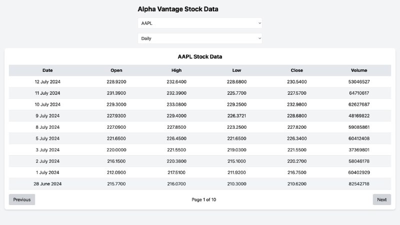
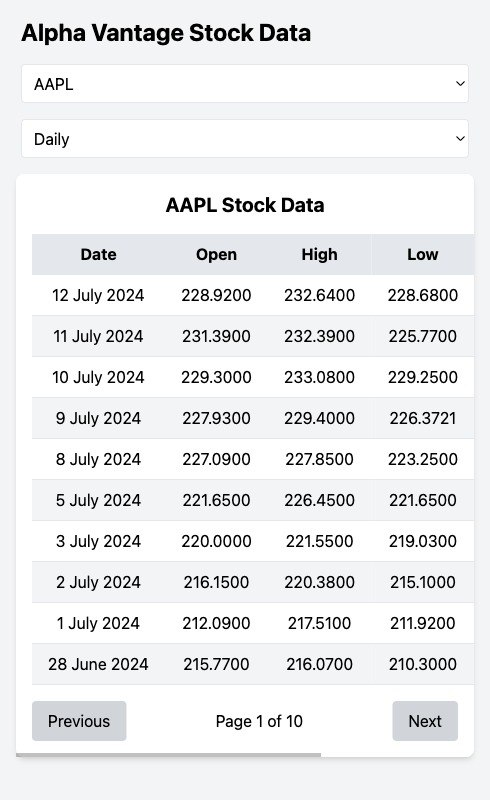

<p align="center">

  <h3 align="center">Alpha Vantage Stock Data App</h3>

  <p align="center">
    This is a React TypeScript application that fetches stock data from the Alpha Vantage API and displays it using Tailwind CSS. The application supports selecting stock symbols and functions from dropdowns and displays the data in a paginated table.
    <br />
    <a href="https://github.com/hemantso/clepher"><strong>Explore the docs »</strong></a>
    <br />
    <br />
    <a href="https://clephertest.netlify.app/">Live version</a>
    ·
    <a href="https://github.com/hemantso/clepher/issues">Report Bug</a>
    ·
    <a href="https://github.com/hemantso/clepher/issues">Request Feature</a>
  </p>
</p>

<!-- TABLE OF CONTENTS -->
## Table of Contents

* [About the Project](#about-the-project)
  * [Built With](#built-with)
* [Getting Started](#getting-started)
  * [Prerequisites](#prerequisites)
  * [Installation](#installation)
* [Roadmap](#roadmap)
* [Contributing](#contributing)
* [Contact](#contact)

<!-- ABOUT THE PROJECT -->
## About The Project
- Fetch stock data from Alpha Vantage API
- Display data in a responsive, paginated table
- Tailwind CSS for styling
- Reusable and performant components

# Website View


# Mobile View

### Built With

- React
- TypeScript
- ESLint
- Tailwind CSS
- Styled components
- Netlify

## Live demo

Deployed to Vercel - [live demo](https://clephertest.netlify.app/).

<!-- GETTING STARTED -->
## Getting Started

To get a local copy up and running follow these simple steps.

### Prerequisites

* npm

    ```sh
    npm install npm@latest -g
    ```

### Installation


1. Clone the repository

  ```bash
  git clone https://github.com/hemantso/clepher.git
  ```

2. Change directory

    ```sh
    cd clepher
    ```

3. Install NPM packages

    ```sh
    npm install
    ```

4. Start the local server

    ```sh
    npm start
    ```

<!-- ROADMAP -->
## Roadmap

Check the [issues](https://github.com/hemantso/clepher/issues).

<!-- CONTRIBUTING -->
## Contributing

Contributions are what make the open-source community such an amazing place to learn, inspire, and create. Any contributions you make are **greatly appreciated**.

1. Fork the Project
2. Create your Feature Branch (`git checkout -b feature/AmazingFeature`)
3. Commit your Changes (`git commit -m 'Add some AmazingFeature'`)
4. Push to the Branch (`git push origin feature/AmazingFeature`)
5. Open a Pull Request

<!-- CONTACT -->
## Contact

👤 **Hemant soni**

- Github: [@githubhandle](https://github.com/hemantso)
- Linkedin: [linkedin](https://www.linkedin.com/in/hemantso/)

